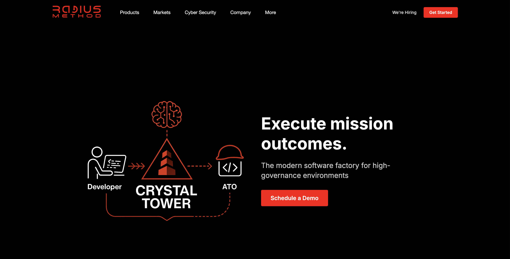

# Radius Method

This repository contains the codebase for the official Radius Method homepage, showcasing Crystal Tower as its flagship product. The website provides visitors with information about Radius Method's services and products, with a particular focus on visualizing AI-powered development workflows.



## Overview

The Radius Method homepage serves as:

- A primary marketing tool for the Crystal Tower product
- A showcase for Radius Method's expertise in AI-enhanced development workflows
- A demonstration of modern web development techniques
- An informational resource for potential clients and partners

## Table of Contents

- [Documentation](./docs/README.md) - Main documentation index
  - [Components](./docs/components/README.md) - Component documentation
    - [Pipeline](./docs/components/pipeline.md) - Pipeline component documentation
    - [PipelineDemo](./docs/components/pipeline-demo.md) - PipelineDemo component documentation
  - [Architecture](./docs/architecture/README.md) - Architecture documentation
    - [Component Structure](./docs/architecture/component-structure.md) - Component architecture overview
    - [Styling Approach](./docs/architecture/styling-approach.md) - CSS module pattern and styling
    - [Next.js Patterns](./docs/architecture/nextjs-patterns.md) - Next.js implementation details
  - [Guides](./docs/guides/README.md) - How-to guides and tutorials
    - [Using the Pipeline Component](./docs/guides/using-pipeline-component.md) - Guide to using the Pipeline component
    - [Contributing](./docs/guides/contributing.md) - Guidelines for contributing to the project

## Key Features

1. **Crystal Tower Showcase** - Featured sections highlighting the capabilities of the Crystal Tower product
2. **Interactive Pipeline Demo** - Visual demonstration of AI-powered workflow pipelines
3. **Responsive Design** - Mobile-friendly interface that adapts to different screen sizes
4. **Modern Web Experience** - Fast, accessible, and engaging user experience
5. **SEO Optimization** - Structured for search engine visibility

## Technology Stack

- **Frontend Framework**: Next.js with App Router architecture
- **Language**: TypeScript
- **Styling**: CSS Modules
- **UI Components**: React components with server/client separation
- **Deployment**: GitHub Actions workflow for automated deployment

## Getting Started

### Prerequisites

- Node.js 18.x or later
- npm or yarn
- Git

### Installation

1. Clone the repository:

```bash
git clone https://github.com/your-org/radius-method.git
cd radius-method
```

2. Install dependencies:

```bash
npm install
# or
yarn install
```

3. Set up environment variables (if needed):

```bash
cp .env.example .env.local
# Edit .env.local with your settings
```

### Development

Start the development server:

```bash
npm run dev
# or
yarn dev
```

Open [http://localhost:3000](http://localhost:3000) in your browser to see the website.

### Building for Production

Build the application for production:

```bash
npm run build
# or
yarn build
```

### Running in Production

Start the production server:

```bash
npm run start
# or
yarn start
```

## Contributing

Please see our [Contributing Guide](./docs/guides/contributing.md) for details on how to contribute to the project.

## License

This project is licensed under the MIT License - see the LICENSE file for details.

## Learn More

To learn more about the technologies used in this project:

- [Next.js Documentation](https://nextjs.org/docs) - Learn about Next.js features and API
- [React Documentation](https://reactjs.org/) - Learn about React
- [TypeScript Documentation](https://www.typescriptlang.org/docs/) - Learn about TypeScript
